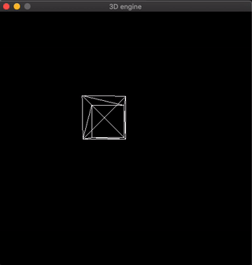

# Doom-engine

 make own Doom-game!

## Demo 
 
### minimap Temp Demo 
 

### Manhattan-Distance based modeling Demo 
 

## Make 3D engine 

 

### reference

- https://www.youtube.com/watch?v=HQYsFshbkYw
- https://github.com/ssloy/tinyraycaster
- https://www.youtube.com/watch?v=ih20l3pJoeU
- https://www.youtube.com/playlist?list=PLv8DnRaQOs5-ST_VDqgbbMRtzMtpK36Hy
